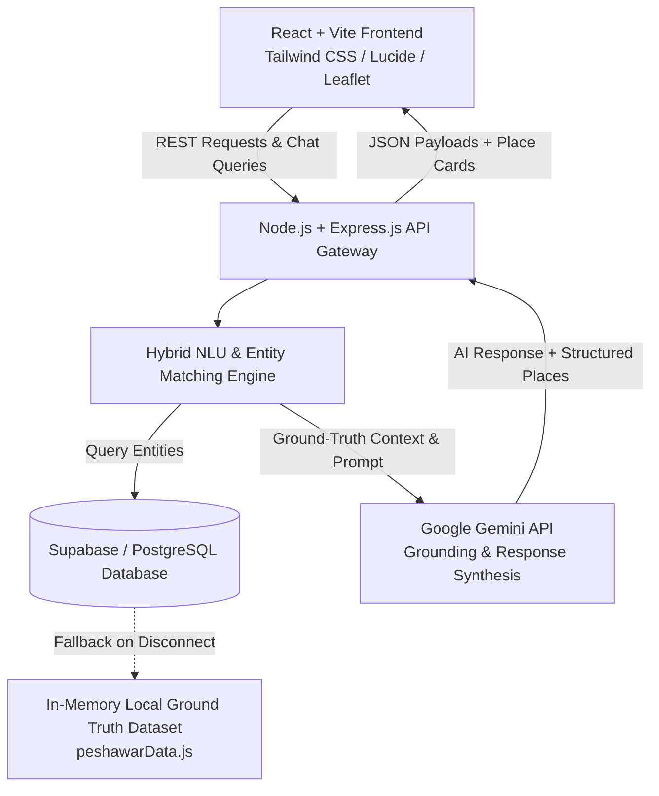
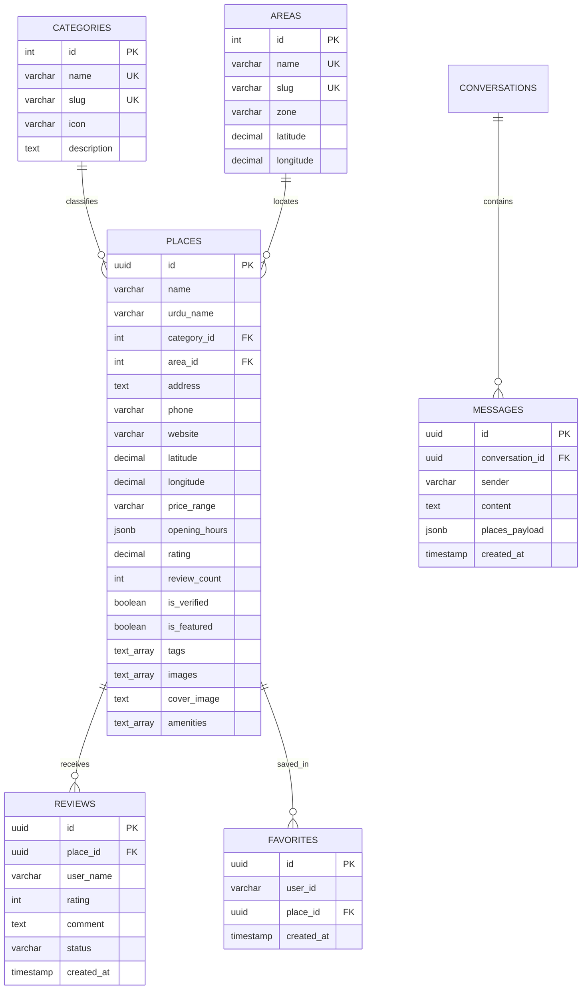
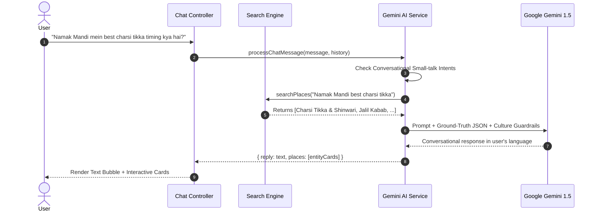

# 🌸 PeshAssist — AI Peshawar Local Guide & Discovery Platform

> **The Definitive, Grounded AI Discovery Engine & Local Companion for Peshawar, Khyber Pakhtunkhwa, Pakistan.**

[](https://react.dev/)
[](https://vitejs.dev/)
[](https://tailwindcss.com/)
[](https://nodejs.org/)
[](https://expressjs.com/)
[](https://ai.google.dev/)
[](https://supabase.com/)
[](https://leafletjs.com/)

---

## 📑 Table of Contents

- [1. Executive Summary & Vision](#1-executive-summary--vision)
- [2. System Architecture](#2-system-architecture)
- [3. Key Features](#3-key-features)
- [4. Technology Stack](#4-technology-stack)
- [5. Repository Structure](#5-repository-structure)
- [6. Database Architecture & Schema](#6-database-architecture--schema)
- [7. AI Grounding & NLU Pipeline](#7-ai-grounding--nlu-pipeline)
- [8. REST API Specification](#8-rest-api-specification)
- [9. Frontend Design & Component Hierarchy](#9-frontend-design--component-hierarchy)
- [10. Installation & Local Development](#10-installation--local-development)
- [11. Environment Configuration](#11-environment-configuration)
- [12. Supabase / PostgreSQL Setup](#12-supabase--postgresql-setup)
- [13. Production Build & Deployment](#13-production-build--deployment)
- [14. Troubleshooting & FAQ](#14-troubleshooting--faq)
- [15. License & Credits](#15-license--credits)

---

## 1. Executive Summary & Vision

**PeshAssist** is an intelligent, full-stack conversational guide and geographic discovery platform built specifically for the historic, culturally vibrant city of **Peshawar, Khyber Pakhtunkhwa, Pakistan**.

### Problem Statement
Navigating Peshawar's rich landscape presents unique challenges:
- Local knowledge is fragmented across word-of-mouth recommendations, social media groups, and outdated directories.
- Generalist LLMs frequently hallucinate closed establishments, incorrect GPS coordinates, invalid phone numbers, or confuse Peshawar with other cities.
- Language diversity requires seamless support for **English**, **Urdu (اردو)**, and **Roman Urdu** (*"Hayatabad mein emergency hospital kahan hai?"*).

### The PeshAssist Solution
PeshAssist bridges this gap through a **grounded AI architecture**:
1. **Zero Hallucination Retrieval**: Every AI answer is grounded in verified real-time database entities (coordinates, opening hours, verified tags, phone numbers).
2. **Trilingual Fluency**: Comprehends colloquial Roman Urdu, formal Urdu, and English effortlessly with cultural warmth (Pashtun hospitality, local landmark references like *Chowk Yadgar, Namak Mandi, Zu BRT, University Road*).
3. **Interactive Visual UI**: Directly embeds interactive place cards, reviews, bookmarking, and Leaflet/OpenStreetMap routing in conversations and directory views.

---

## 2. System Architecture



### Flow Breakdown
1. **User Query**: User sends a natural language message in English, Urdu, or Roman Urdu.
2. **Intent Analysis & Entity Matcher**: The backend identifies areas (e.g., *Saddar, Hayatabad, Namak Mandi*), categories (e.g., *Hospitals, Dining, Tech*), keywords, and user intent.
3. **Data Retrieval**: Matching records are extracted from Supabase/PostgreSQL (or the high-fidelity local dataset fallback).
4. **Context Injection**: Filtered ground truth is passed to Google Gemini with strict anti-hallucination instructions.
5. **Card Synthesis & Response**: Gemini responds with conversational advice while the backend bundles verified place cards rendered natively in the UI.

---

## 3. Key Features

### 🌸 Conversational AI Guide
- **Roman Urdu & Urdu Understanding**: Seamlessly answers queries like *"Namak Mandi mein best dumbah karahi kahan hai?"* or *"Hayatabad phase 3 me 24/7 hospital"*.
- **Small-Talk & Etiquette Handling**: Recognizes greetings (*"Salam", "Aoa", "Kese ho"*) with culturally polite replies.
- **Embedded Interactive Place Cards**: Instant 1-click access to maps, contact info, ratings, and reviews inside chat bubbles.

### 🏛️ Categorized Peshawar Discovery
Comprehensive directory across **8 core sectors** and **10 key zones**:
1. **Restaurants & Dining**: Traditional Shinwari BBQ, Charsi Tikka, Jalil Chapli Kabab, Habibi, Jan's Deli, Chief Burger, cafes.
2. **Hospitals & Healthcare**: Lady Reading Hospital (LRH), Khyber Teaching Hospital (KTH), Hayatabad Medical Complex (HMC), Northwest General, Shaukat Khanum.
3. **Heritage & Tourism**: Bala Hissar Fort, Sethi Houses, Peshawar Museum, Mahabat Khan Mosque, Bab-e-Khyber, Gor Khatri.
4. **Shopping & Bazaars**: Qissa Khwani, Karkhano Markets, Deans Trade Center, Mina Bazaar.
5. **Education & Universities**: Islamia College University, UET Peshawar, Edwardes College, Khyber Medical University.
6. **Tech & Hardware Services**: Gul Haji Plaza (laptop repairs), Bilour Plaza, Deans Computer Market.
7. **Hotels & Stays**: Serena Hotel Peshawar, Pearl Continental (PC), Shelton Rezidor, Emaraat Hotel.
8. **Transport & Transit**: Zu Peshawar BRT Main Corridors, Bacha Khan International Airport, Peshawar Cantt Railway Station.

### 🗺️ Interactive OpenStreetMap & Routing
- Interactive Leaflet map with custom category markers.
- Deep links for **Google Maps Turn-by-Turn Navigation** with exact latitude and longitude.

### ⭐ Reviews & Personal Favorites
- Authenticated user reviews with 1–5 star ratings.
- Real-time bookmarking / wishlist stored in context and database.

### 🛡️ Admin Management Portal
- Real-time administrative metrics (total places, verified ratio, category counts).
- Full **CRUD** functionality (Add place, Edit details, Delete, Toggle verified badge).

---

## 4. Technology Stack

### Frontend
- **Framework**: React 18 (SPA)
- **Bundler & Tooling**: Vite 5
- **Styling**: Tailwind CSS 3.4 + PostCSS + Autoprefixer
- **Icons**: Lucide React
- **Mapping**: Leaflet 1.9 + React-Leaflet 4.2
- **Routing**: React Router DOM 6.22

### Backend
- **Runtime**: Node.js (ES Modules `type: "module"`)
- **Web Framework**: Express.js 4.19
- **CORS & Security**: CORS middleware with configurable client whitelist
- **Environment Management**: `dotenv`

### Intelligence & AI
- **LLM Engine**: Google Generative AI (`@google/generative-ai`) — Gemini 1.5 Flash
- **Grounding Architecture**: Hybrid lexical scoring + category/area tagging + strict system prompt guardrails

### Database & Storage
- **Primary Database**: PostgreSQL / Supabase
- **Local Fallback**: Comprehensive embedded dataset (`server/data/peshawarData.js`) ensuring 100% offline uptime

---

## 5. Repository Structure

```
PeshAssist/
├── client/                         # Frontend React + Vite SPA
│   ├── public/                     # Static assets & icons
│   ├── src/
│   │   ├── assets/                 # Images & branding assets
│   │   ├── components/             # Reusable UI components
│   │   │   ├── ChatPlaceCard.jsx   # Interactive place preview inside chat
│   │   │   ├── Footer.jsx          # App footer with local links
│   │   │   ├── MapView.jsx         # Leaflet map component with markers
│   │   │   ├── Navbar.jsx          # Navigation header & search shortcuts
│   │   │   ├── PlaceCard.jsx       # Discovery grid place card
│   │   │   ├── PlaceModal.jsx      # Detailed place popup modal
│   │   │   ├── RatingStars.jsx     # Reusable star rating component
│   │   │   └── ReviewModal.jsx     # Review submission modal
│   │   ├── context/                # React Context state management
│   │   │   ├── AuthContext.jsx     # User authentication state
│   │   │   ├── ChatContext.jsx     # Chat history & suggestions state
│   │   │   └── FavoritesContext.jsx# Bookmarks & favorites state
│   │   ├── layouts/
│   │   │   └── MainLayout.jsx      # Master layout with Navbar & Footer
│   │   ├── pages/
│   │   │   ├── AdminDashboard.jsx  # Admin analytics & CRUD table
│   │   │   ├── ChatPage.jsx        # AI Assistant chat interface
│   │   │   ├── ExplorePage.jsx     # Multi-filter category & area explorer
│   │   │   ├── FavoritesPage.jsx   # User saved places view
│   │   │   ├── Home.jsx            # Landing page with hero & trending spots
│   │   │   ├── LoginPage.jsx       # User authentication page
│   │   │   └── PlaceDetailsPage.jsx# Deep place details & review page
│   │   ├── services/
│   │   │   └── api.js              # Centralized Axios/fetch client
│   │   ├── App.jsx                 # Route definitions & providers
│   │   ├── main.jsx                # Application DOM entry point
│   │   └── index.css               # Tailwind directives & global styling
│   ├── .env.example                # Client environment template
│   ├── package.json                # Client dependencies
│   └── vite.config.js              # Vite configuration
│
├── server/                         # Backend Express REST API
│   ├── config/
│   │   └── supabase.js             # Supabase client initialization
│   ├── controllers/
│   │   ├── adminController.js      # Admin statistics & CRUD controllers
│   │   ├── chatController.js       # AI chat & query suggestion handlers
│   │   ├── favoritesController.js  # Favorites management handlers
│   │   ├── healthController.js     # Health probe endpoint
│   │   ├── placesController.js     # Places & taxonomy retrieval
│   │   └── reviewsController.js    # Review submission & retrieval
│   ├── data/
│   │   ├── peshawarData.js         # Comprehensive local dataset (places/areas/categories)
│   │   └── schema.sql              # PostgreSQL / Supabase SQL schema
│   ├── middleware/
│   │   └── errorHandler.js         # Centralized 404 & error handlers
│   ├── routes/
│   │   └── api.js                  # Express API route declarations
│   ├── services/
│   │   ├── geminiService.js        # Gemini AI prompt grounding & NLU
│   │   └── searchService.js        # Hybrid place searching & filtering engine
│   ├── .env.example                # Server environment template
│   ├── package.json                # Server dependencies
│   └── server.js                   # Main Express application entry point
│
├── .gitignore                      # Git ignore rules
├── package.json                    # Root monorepo orchestrator scripts
└── README.md                       # Complete project documentation
```

---

## 6. Database Architecture & Schema

The database schema is defined in [`server/data/schema.sql`](file:///e:/My%20Projects/PeshAssist/server/data/schema.sql) and runs on PostgreSQL / Supabase.

### Entity Relationship Diagram



### Table Definitions

| Table | Purpose | Primary Key | Key Fields / Indexes |
|---|---|---|---|
| `categories` | Defines the 8 taxonomy classifications | `id` (SERIAL) | `slug` (UNIQUE), `icon` |
| `areas` | City sectors, zones, and central GPS points | `id` (SERIAL) | `slug` (UNIQUE), `zone` |
| `places` | Master directory of Peshawar points of interest | `id` (UUID) | GIN text search index on `(name, description)`, `category_id`, `area_id`, `rating` |
| `reviews` | User reviews and ratings (1–5 scale) | `id` (UUID) | `place_id` (FK), `rating`, `status` |
| `favorites` | Bookmarked places per user | `id` (UUID) | Unique composite `(user_id, place_id)` |
| `conversations` | AI Chat sessions | `id` (UUID) | `user_id`, `title` |
| `messages` | Chat message logs with attached place cards | `id` (UUID) | `conversation_id` (FK), `places_payload` (JSONB) |

---

## 7. AI Grounding & NLU Pipeline

To ensure 100% accuracy and prevent generic hallucinations, PeshAssist uses a **4-stage grounding pipeline**:



### System Instruction Guardrails
- **Ground Truth Invariant**: The model is forbidden from inventing telephone numbers, pricing, or locations.
- **Multilingual Resonance**: Answers in the user's selected dialect (English, Urdu, or Roman Urdu).
- **Pashtun Cultural Etiquette**: Incorporates local idioms, welcoming tone, and customary respect.

---

## 8. REST API Specification

Base URL: `http://localhost:5000/api`

### 1. System Health
#### `GET /api/health`
Returns backend operational status, uptime, and database connection state.
```json
{
  "status": "healthy",
  "timestamp": "2026-09-29T09:25:00.000Z",
  "environment": "development",
  "version": "1.0.0"
}
```

---

### 2. Chat & AI
#### `POST /api/chat`
Processes conversational queries and returns AI text plus verified entity cards.
- **Request Body**:
  ```json
  {
    "message": "Where can I get laptop repair near Saddar?",
    "history": []
  }
  ```
- **Response (200 OK)**:
  ```json
  {
    "success": true,
    "reply": "For laptop and motherboard repairs in Saddar and University Road...",
    "places": [
      {
        "id": "p-701",
        "name": "Gul Haji Plaza Tech City",
        "area_name": "University Road",
        "category_slug": "services",
        "rating": 4.6,
        "address": "Main University Road, near Saddar, Peshawar",
        "phone": "+92 91 5841290"
      }
    ]
  }
  ```

#### `GET /api/chat/suggestions`
Returns quick-tap sample queries for the chat UI.

---

### 3. Places & Taxonomy
#### `GET /api/places`
Retrieves places with query filtering.
- **Query Parameters**:
  - `category` *(string, optional)*: e.g., `restaurants`, `hospitals`, `services`
  - `area` *(string, optional)*: e.g., `hayatabad`, `saddar`, `namak-mandi`
  - `search` *(string, optional)*: keyword search
  - `featured` *(boolean, optional)*: `true` / `false`
  - `verified` *(boolean, optional)*: `true` / `false`
  - `sort` *(string, optional)*: `rating`, `reviews`, `name`

#### `GET /api/places/:id`
Retrieves single place details by UUID / slug ID with full amenities, gallery images, and reviews.

#### `GET /api/categories`
Returns all 8 category classifications with metadata and icon identifiers.

#### `GET /api/areas`
Returns all 10 Peshawar zones with latitude and longitude bounds.

---

### 4. Reviews & Ratings
#### `GET /api/reviews/:placeId`
Retrieves all approved reviews for a given place.

#### `POST /api/reviews`
Submits a new review.
- **Request Body**:
  ```json
  {
    "place_id": "p-101",
    "user_name": "Hamza Khan",
    "rating": 5,
    "comment": "Best Dumbah Karahi in Namak Mandi! Fresh and authentic."
  }
  ```

---

### 5. Favorites
#### `GET /api/favorites`
Retrieves all bookmarked places for the active user.

#### `POST /api/favorites/:placeId`
Toggles bookmark status (add/remove) for a place.

---

### 6. Admin Control Center
#### `GET /api/admin/stats`
Returns system metrics: total places, verified count, category counts, average rating.

#### `GET /api/admin/places`
Retrieves full list of places for admin data table.

#### `POST /api/admin/places`
Creates a new verified place.

#### `PUT /api/admin/places/:id`
Updates existing place metadata.

#### `DELETE /api/admin/places/:id`
Deletes a place from the database.

---

## 9. Frontend Design & Component Hierarchy

### Page Structure & Routes

| Route | Page Component | Purpose |
|---|---|---|
| `/` | `Home.jsx` | Landing hero, quick search, featured categories, trending places, cultural highlights |
| `/explore` | `ExplorePage.jsx` | Full directory with category tabs, area dropdowns, search bar, map toggle |
| `/chat` | `ChatPage.jsx` | Multilingual AI Chat assistant with embedded cards and suggestion pills |
| `/place/:id` | `PlaceDetailsPage.jsx` | Full-screen place view, gallery, map, operating hours, review submission |
| `/favorites` | `FavoritesPage.jsx` | Personal saved places collection |
| `/admin` | `AdminDashboard.jsx` | Analytics summary, place management table, modal forms |
| `/auth/login` | `LoginPage.jsx` | User authentication interface |

### Key Components
- [`MapView.jsx`](file:///e:/My%20Projects/PeshAssist/client/src/components/MapView.jsx): Leaflet Map container with dynamic custom pins and popup previews.
- [`PlaceCard.jsx`](file:///e:/My%20Projects/PeshAssist/client/src/components/PlaceCard.jsx): Responsive card with price badge, category tag, rating, and bookmark trigger.
- [`ChatPlaceCard.jsx`](file:///e:/My%20Projects/PeshAssist/client/src/components/ChatPlaceCard.jsx): Compact interactive card rendered inside AI chat messages.
- [`PlaceModal.jsx`](file:///e:/My%20Projects/PeshAssist/client/src/components/PlaceModal.jsx): Quick preview modal for swift browsing without leaving the current view.
- [`ReviewModal.jsx`](file:///e:/My%20Projects/PeshAssist/client/src/components/ReviewModal.jsx): Interactive star picker and feedback submission form.

---

## 10. Installation & Local Development

### Prerequisites
- **Node.js**: `v18.0.0` or higher ([Download Node.js](https://nodejs.org/))
- **npm**: `v9.0.0` or higher
- **Git**

### Step 1: Clone Repository
```bash
git clone https://github.com/Latifkhan-cyber/PeshAssist.git
cd PeshAssist
```

### Step 2: Install All Dependencies
You can install all root, backend, and frontend dependencies with a single command:
```bash
npm run install:all
```
*(Or install separately in each folder):*
```bash
cd server && npm install
cd ../client && npm install
```

### Step 3: Configure Environment Variables
Create `.env` files in both `server/` and `client/` directories (see [Section 11](#11-environment-configuration)).

### Step 4: Run Development Servers
Open two terminal windows:

**Terminal 1 (Backend Server):**
```bash
npm run dev:server
# Server starts on http://localhost:5000
```

**Terminal 2 (Frontend Client):**
```bash
npm run dev:client
# Vite dev server starts on http://localhost:5173
```

Visit **`http://localhost:5173`** in your browser! 🚀

---

## 11. Environment Configuration

### Backend: `server/.env`
Create a `.env` file in the `server/` directory:

```env
# Server Port & Mode
PORT=5000
NODE_ENV=development
CLIENT_URL=http://localhost:5173

# Google Gemini API Key (Get from https://aistudio.google.com/)
GEMINI_API_KEY=AIzaSy...your_gemini_api_key

# Supabase PostgreSQL Database (Optional - Fallback dataset runs automatically if omitted)
SUPABASE_URL=https://your-project.supabase.co
SUPABASE_ANON_KEY=your_supabase_anon_key
SUPABASE_SERVICE_ROLE_KEY=your_supabase_service_role_key
```

### Frontend: `client/.env`
Create a `.env` file in the `client/` directory:

```env
# Backend API Base Endpoint
VITE_API_URL=http://localhost:5000/api
```

---

## 12. Supabase / PostgreSQL Setup

PeshAssist includes an enterprise SQL script ready to execute:

1. Create a free project at [Supabase](https://supabase.com).
2. Navigate to **SQL Editor** in your Supabase dashboard.
3. Open [`server/data/schema.sql`](file:///e:/My%20Projects/PeshAssist/server/data/schema.sql), copy all lines, paste into the SQL editor, and click **Run**.
4. Copy your `Project URL` and `anon/service_role keys` into `server/.env`.
5. *(Optional)*: If Supabase credentials are not provided, PeshAssist **automatically uses its embedded high-fidelity dataset** (`peshawarData.js`) so the entire application works seamlessly out-of-the-box!

---

## 13. Production Build & Deployment

### Building Client Bundle
```bash
npm run build
```
This generates optimized static files inside `client/dist/`.

### Deployment Options

#### 1. Frontend (Vercel / Netlify / Cloudflare Pages)
- **Root Directory**: `client`
- **Build Command**: `npm run build`
- **Output Directory**: `dist`
- **Environment Variable**: `VITE_API_URL=https://your-api-domain.com/api`

#### 2. Backend (Render / Railway / DigitalOcean)
- **Root Directory**: `server`
- **Build Command**: `npm install`
- **Start Command**: `node server.js`
- **Environment Variables**: Add `PORT`, `NODE_ENV=production`, `CLIENT_URL`, `GEMINI_API_KEY`, `SUPABASE_URL`, `SUPABASE_ANON_KEY`.

---

## 14. Troubleshooting & FAQ

### Q1: Does the AI work without a Google Gemini API Key?
**Yes!** If `GEMINI_API_KEY` is not provided or invalid, PeshAssist automatically activates its **Intelligent Hybrid NLU Engine**, which resolves intent, categorizes queries, and generates rich contextual responses with verified place cards.

### Q2: What languages can I speak with PeshAssist?
PeshAssist natively understands:
- **English**: *"Where is the best mutton karahi in Namak Mandi?"*
- **Roman Urdu**: *"Saddar mein laptop repair ki dukan kahan hai?"*
- **Urdu (اردو)**: *"حیات آباد میں 24 گھنٹے ایمرجنسی ہسپتال کون سا ہے؟"*

### Q3: Why OpenStreetMap instead of Google Maps API?
Leaflet with OpenStreetMap tiles provides high-speed, privacy-first, zero-cost mapping. However, every place card also includes direct deep-links that open **Google Maps with exact coordinates** for turn-by-turn driving directions!

---

## 15. License & Credits

- **License**: ISC License
- **Developed for**: The city of Peshawar, Khyber Pakhtunkhwa, Pakistan.
- **Created with**: Passion for local discovery, culture, and AI accessibility.

---

*Made with ❤️ for Peshawar (پیښور).*
